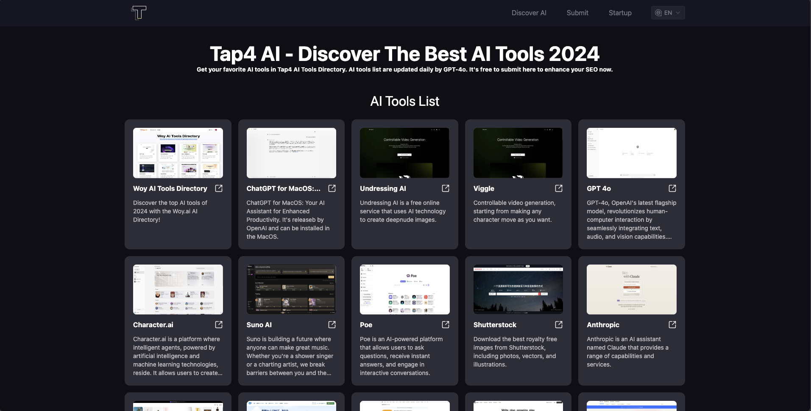

# Tap4 AI Web UI

Tap4 AI Web UI is the open source AI tools directory build by [Tap4 AI Tools Directory](https://tap4.ai). The project
aims to help everyone build their own AI Tools Directory easily. You can fork the project and deploy to vercel by one
click and update your own ai tools by the dataList in the project.

English | [简体中文](https://github.com/6677-ai/tap4-ai-webui-lite/blob/main/README.zh-CN.md)

## Link Me

You can contact me at Twitter: https://x.com/tap4ai

if this project is helpful to you, buy me a coffee.

<a href="https://www.buymeacoffee.com/tap4ai0o" target="_blank"></a>

If you are interested with the project, you can add my wechat: helloleo2023, comment: "tap4 ai open-source" and I will
add you to the wechat group.

## Features

- Internationalization
- SEO friendly (with i18n)
- sitemap.xml (dynamic with i18n)
- Ship fast
- NEXT 14 with app route (react server component)
- Supabase serverless database



## Quick Start

#### Signup a account on supabase then create a project

[https://supabase.com](https://supabase.com) and run the script in the project: db/db.sql

### Deploy on Vercel **(Don't forget to setup env)**

[](https://vercel.com/new/clone?repository-url=https%3A%2F%2Fgithub.com%2F6677-ai%2Ftap4-ai-webui.git&env=NEXT_PUBLIC_SITE_URL,GOOGLE_TRACKING_ID,GOOGLE_ADSENSE_URL,CONTACT_US_EMAIL,NEXT_PUBLIC_SUPABASE_URL,NEXT_PUBLIC_SUPABASE_ANON_KEY&project-name=tap4-ai)

The environment as below:

```sh
# your domain
NEXT_PUBLIC_SITE_URL="https://www.tap4.ai"

# google tracking id and adsense URL
GOOGLE_TRACKING_ID="G-XXXXXXX"
GOOGLE_ADSENSE_URL="https://xxxx.googlesyndication.com/xxxxx/xxxxx"

# Footer contact email
CONTACT_US_EMAIL="contact@tap4.ai"

# your supabase database url and key
NEXT_PUBLIC_SUPABASE_URL="https://xxxyyyzzz.supabase.co"
NEXT_PUBLIC_SUPABASE_ANON_KEY="XXX.YYY.ZZZ"
```

## Runs on local

### install

- node
- nvm
- pnpm

### setup

#### (1) clone this project

```sh
git clone https://github.com/6677-ai/tap4-ai-webui.git
```

#### (2) signup a account on supabase then create a project

[https://supabase.com](https://supabase.com) and run the script in the project: db/db.sql

#### (3) setup env

- root folder, create `.env.local` file and fill with values, for example:

```sh
# your domain
NEXT_PUBLIC_SITE_URL="https://www.tap4.ai"

# google tracking id and adsense URL
GOOGLE_TRACKING_ID="G-XXXXXXX"
GOOGLE_ADSENSE_URL="https://xxxx.googlesyndication.com/xxxxx/xxxxx"

# Footer contact email
CONTACT_US_EMAIL="contact@tap4.ai"

# your supabase database url and key
NEXT_PUBLIC_SUPABASE_URL="https://xxxyyyzzz.supabase.co"
NEXT_PUBLIC_SUPABASE_ANON_KEY="XXX.YYY.ZZZ"
```

#### (4) runs on dev mode

switch to the particular node version

```sh
nvm use
```

install packages

```sh
pnpm i
```

run on dev mode

```sh
pnpm dev
```

## How to upate your content?

### update "home" or "explore" page (`/` or `/explore`)

```sh
lib/data.ts -> dataList
```

### update detail page (`/ai/website-name`)

- PS: `detail` supports markdown

```sh
lib/data.ts -> detailList
```

### submit website and read it from database

1. runs the website and then go to `/submit` page
2. input the values and then submit the form
3. open and check your supabase project

## Wanna submit your website on Tap4.ai?

### Wanna add you website to our `/startup` page?

- open an issue here: [TAP4-AI-Directory](https://github.com/6677-ai/TAP4-AI-Directory/issues)
- email us: contact@tap4.ai

## Links to our products

### TAP4-AI-Directory

The Collection for the AI tools all over the world. | Collect free ChatGPT mirrors, alternatives,prompt, other AI tools,
etc. For more, please visit: [Tap4 AI](https://tap4.ai)

### How to get your first users for startup at the website list

Here is the website list for submit your product to get users. Please visit
[StartUp Your Product List](https://github.com/6677-ai/TAP4-AI-Directory/blob/main/Startup-Your-Product-List.md)

### Flux AI Image Generator

Flux AI Image Generator is currently available for free experience, please visit
[Flux AI Image Generator](https://flux-ai.io/)

### Photo to Video AI

Photo to Video AI is currently available for free experience, please visit
[Photo to Video AI](https://dreammachineai.online/)

### Flux 1.1 Pro - Free Online Flux.1 AI Image Generator

[Flux 1.1 Pro](https://fluxproweb.com/)


### Free Stable Diffusion 3 Online Tool

[Free Stable Diffusion 3 Online](https://stable-diffusion-3.online/)

### Free Tiny Png Tool

[Free Type Png Tool](https://freetinypng.com/)


### Free GPT2 Output Detector

[Free GPT2 Output Detector](https://openai-openai-detector.com/)

### Flux Pro Image Generator

Flux Pro Image Generator is currently available for free experience, please visit
[Flux Pro Image Generator](https://flux-pro.net/)

### The Tattoo AI Generator and Design

Tattao AI Design is a tattoo ai generator and design for the tattoo fans. If you are interested with it, visit
[Tattoo AI Design](https://tattooai.design)

## Other open source

### Website content AI crawler

visit: [6677-ai/tap4-ai-crawler](https://github.com/6677-ai/tap4-ai-crawler).
